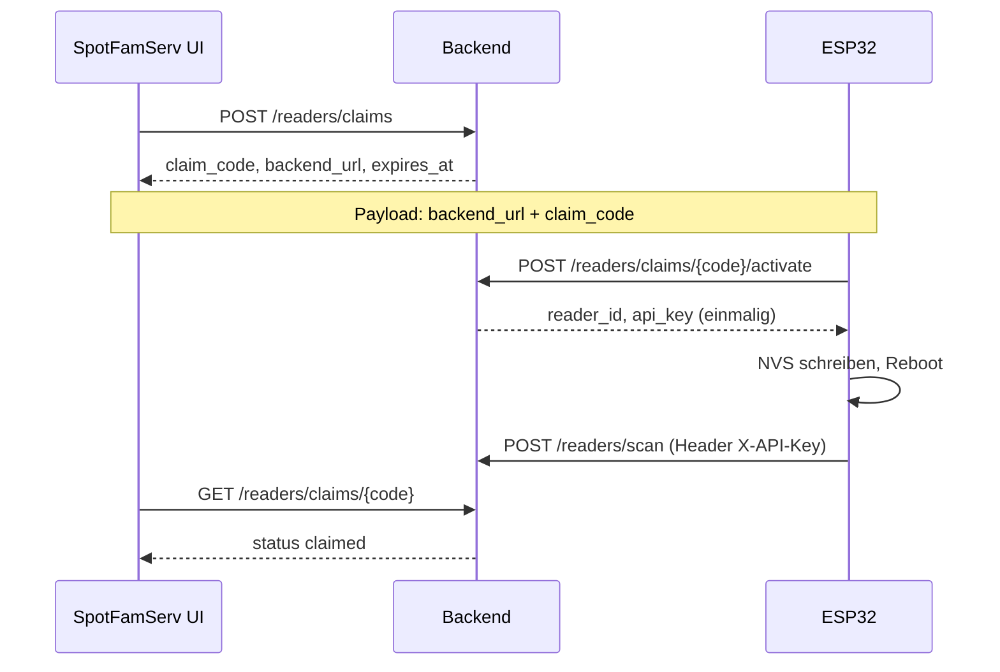

# ESP32-Reader-Provisioning

Stand: 2026-06-08 · Plan: `tasks/plan-pn532-reader-firmware-ota.md` · Decision: D-018

## Zielbild

ESP32-Reader (Board `esp32-wroom-32`, Ziel-RFID: PN532/HW-147) werden nach einem initialen USB-Flash ohne PC betrieben: Captive Portal für WLAN/Backend/Claim, Backend liefert `reader_id` und per-Reader-API-Key, danach normale Reader-APIs (`/api/v1/readers/scan|next|previous`). Spotify-Tokens und Backend-Admin-Credentials liegen **nicht** auf dem ESP.

Software-Stand in diesem Branch: PN532-Reader-Firmware fuer ESP32-WROOM-32, Captive-Portal-MVP, NVS-Konfiguration, Claim-Aktivierung, Backend-Scan und OTA-Client sind implementiert. Flash-Station und Backend-Manifest nutzen registrierte Firmware-Artefakte. Sprint-Done bleibt hardware-blockiert, bis UID-Gleichheit, echter Scan, Flash/OTA und Recovery am realen ESP nachgewiesen sind.

## Claim-Flow (Betrieb)



1. Im eingeloggten Frontend: **RFID-Leser → Reader hinzufügen** → Claim erzeugen (TTL 10 Min).
2. JSON-Payload ins Captive Portal (oder QR) übertragen; ESP verbindet ins Heim-WLAN und ruft `activate` auf.
3. Plain-API-Key nur in der Activate-Antwort; Backend speichert nur den Hash. UI pollt Status bis `claimed`.
4. Reader erscheint in `GET /readers` mit `has_api_key: true`; Box-Zuordnung wie in `docs/reader-box-mapping.md`.

**Pi-/Legacy-Leser:** Unverändert Auto-Register beim ersten Scan ohne API-Key (`has_api_key: false`). Kein Claim nötig.

## API-Endpunkte

Basis: `/api/v1`. JSON. Fehlerbody: `{ "error": "<code>", "message": "..." }`.

| Methode | Pfad | Aufrufer | Zweck |
|---------|------|----------|--------|
| `POST` | `/readers/claims` | Frontend (Admin-Session, sobald Auth aktiv) | Claim erzeugen |
| `GET` | `/readers/claims/{claimCode}` | Frontend | Status `pending` \| `claimed` \| `expired` |
| `POST` | `/readers/claims/{claimCode}/activate` | ESP (ohne vorherigen Key) | Claim einlösen, Reader + API-Key anlegen |
| `GET` | `/readers/firmware/manifest` | ESP | OTA-Check gegen registrierte Firmware-Artefakte |
| `GET` | `/readers/firmware/{board}/{channel}/{version}.bin` | ESP | Firmware-Binary herunterladen |
| `POST` | `/readers/{readerId}/api-key` | Admin | Key rotieren (Plain-Key einmalig) |
| `DELETE` | `/readers/{readerId}/api-key` | Admin | Key widerrufen → Fallback globaler `READER_API_KEY` |

### `POST /readers/claims`

Request (optional):

```json
{ "reader_name": "Küche", "fw_channel": "stable" }
```

Response `201`:

```json
{
  "claim_code": "ABCD2345",
  "expires_at": "2026-06-03T12:10:00+00:00",
  "backend_url": "http://192.168.1.91:8080",
  "fw_channel": "stable"
}
```

- Claim-Code: 8 Zeichen, `A-Z` + `2-9`, ohne `0`, `1`, `I`, `O`; Eingabe case-insensitive.
- `backend_url` aus Request-Host (Pi: LAN-IP + Port).

### `GET /readers/claims/{claimCode}`

Response `200`:

```json
{
  "status": "pending",
  "expires_at": "...",
  "reader_id": null,
  "fw_channel": "stable"
}
```

Nach Activate: `status: "claimed"`, `reader_id` gesetzt.

### `POST /readers/claims/{claimCode}/activate`

Request:

```json
{
  "device_nonce": "<stabil pro Gerät, z. B. MAC>",
  "board": "esp32-wroom-32",
  "firmware_version": "0.1.0"
}
```

Response `201`:

```json
{
  "reader_id": "esp-a1b2c3d4e5f6",
  "api_key": "<hex, nur einmal>",
  "fw_channel": "stable"
}
```

Fehlercodes: `invalid_request` (400), `unknown_claim` (404), `expired_claim` (410), `claim_already_used` (409), `unsupported_board` (422), `too_many_attempts` (429 nach 5 fehlgeschlagenen Activate-Versuchen pro Claim).

Aktivierung ist transaktional (kein Doppel-Key bei parallelen Requests). Activity-Log: `reader_claim_created`, `reader_claim_redeemed`, `reader_claim_failed`.

## NVS-Schema (Firmware-Ziel)

Namespace `spotfam` (Preferences/NVS):

| Key | Inhalt |
|-----|--------|
| `wifi_ssid` | Heim-WLAN |
| `wifi_password` | Heim-WLAN |
| `backend_url` | z. B. `http://192.168.1.91:8080` |
| `reader_id` | nach Claim |
| `reader_api_key` | Plain-Key nach Claim |
| `fw_channel` | z. B. `stable` |
| `claim_code` | nur bis erfolgreicher Activate-Call |

**Nicht in NVS:** Spotify Access/Refresh Token, Spotify Client Secret, Admin-Credentials, Plain-Claim-Code nach erfolgreicher Aktivierung.

**Compatibility:** Die Firmware liest fuer alte Flash-Agent-Artefakte zusaetzlich `wifi_pass`, `reader_key` und `ota_channel`, schreibt aber kanonisch `wifi_password`, `reader_api_key` und `fw_channel`.

**Reset:** Runtime-Reset ueber Button ist noch nicht freigegeben, weil die realen Button-/GPIOs am AZ-Delivery-Board bestaetigt werden muessen. Factory Reset erfolgt bis dahin per Reflash/NVS-Loeschen.

`secrets.h` bleibt nur Dev-/Factory-Fallback, kein Produktpfad.

## Captive-Portal-Payload

MVP-Minimum (Frontend kopiert als JSON):

```json
{
  "backend_url": "http://192.168.1.91:8080",
  "claim_code": "ABCD2345"
}
```

Portal erfasst zusätzlich WLAN-SSID und -Passwort. AP nur wenn die Firmware keine lauffähige Runtime-Konfiguration findet (`SpotFam-Reader-<short-id>`). Kein Logging von WLAN-Passwort oder API-Key; Captive Portal ist kein Hochsicherheitskanal — Risiko über kurze TTL, Einmal-Claim und per-Reader-Key begrenzt.

## OTA-Manifest (Minimalvertrag)

`GET /api/v1/readers/firmware/manifest?board=esp32-wroom-32&channel=stable&current_version=MAJOR.MINOR.PATCH`

- Pflicht-Query: `board`, `current_version` (SemVer `^\d+\.\d+\.\d+$`); `channel` default `stable`.
- Unterstützt: `board=esp32-wroom-32`, `channel=stable`.
- **`204 No Content`:** kein neueres registriertes Artefakt.
- **`200`** wenn Artefakt existiert:

```json
{
  "board": "esp32-wroom-32",
  "channel": "stable",
  "version": "1.0.1",
  "min_version": "1.0.0",
  "download_url": "/api/v1/readers/firmware/esp32-wroom-32/stable/1.0.1.bin",
  "sha256": "<hex>",
  "size_bytes": 1147892,
  "signature": null,
  "released_at": "2026-06-03T12:00:00+00:00"
}
```

ESP-Regeln: `board` und gespeicherter `fw_channel` müssen passen; `version` > `current_version`; kein Downgrade; bei `current_version < min_version` kein blindes Update; fehlgeschlagenes OTA darf die laufende Firmware nicht zerstören. MVP: SHA-256-Pflicht; Signatur vor Consumer-Release klären (Hash-only = dokumentiertes Risiko).

Fehler: `invalid_request` (400), `unsupported_board` (422).

## Security

- **Claim-Code:** kurzlebig, gehasht gespeichert (`claim_code_hash`), Plain-Code nicht loggen.
- **API-Key:** nur Hash in DB; Plain nur in Activate-Response; Rotation/Widerruf über `/readers/{id}/api-key`.
- **Kein Spotify auf ESP:** Playback-OAuth bleibt am Backend/Profil.
- **Physischer Zugriff:** NVS-Key extrahierbar → per-Reader-Key, Revoke, begrenzte Reader-Rechte.
- **Activate:** Rate-Limit pro Claim (5 Fehlversuche); `device_nonce` + Zufall für `reader_id`-Kollisionen.
- **Scan/Next/Previous:** Weiterhin `X-API-Key` oder `Authorization: Bearer` (per-Reader oder globaler Fallback aus `.env`).
- **Firmware-Manifest:** Liefert nur registrierte lokale Artefakte. SHA-256 ist Pflicht; `signature: null` bleibt ein bewusstes LAN-MVP-Risiko und ist keine Herkunftssicherung.

## Hardware-Gate HW-0

Vor Sprint-Done/Release physisch nachweisen (Plan-Abschnitt HW-0):

- PN532/HW-147: Modul, DIP, Bus, Pinout dokumentiert.
- UID einer Testkarte identisch Pi vs. ESP.
- `/readers/scan` mit provisioniertem Key; LED/Buttons nachvollziehbar.
- Flash/OTA-Partition geprüft; Test-OTA mit Hash-/Board-Ablehnung.
- Evidence: Datum, Pinout-Tabelle, Test-UIDs, Ergebnis je Kriterium.

Ohne HW-0: Software-Merge und CI ≠ produktionsreifer ESP-Reader.

## Grenzen (aktueller Schnitt)

| Bereich | Stand |
|---------|--------|
| Backend Claim + Manifest/Download | Implementiert, getestet |
| Frontend Reader hinzufügen | Implementiert |
| CI Firmware-Compile | PN532-Reader-Firmware via `arduino-cli` (`esp32:esp32@3.3.8`, Partition `no_fs`) |
| ESP Firmware (Portal, NVS, PN532, OTA-Client) | Implementiert; Hardware-E2E offen |
| OTA-Binärartefakt | Kann per Flash-Station registriert werden; reales Testartefakt noch zu verifizieren |
| HW-0 | Teilweise: PN532-Erkennung beobachtet; UID-Gleichheit/Scan/OTA offen |
| Signiertes OTA | Entscheidung offen (`signature: null` im Vertrag) |

**Merge ≠ Sprint-Done:** Grüne CI und gemergter PR schließen den Software-Schnitt, nicht den Sprint — UID-Gleichheit, realer Backend-Scan, Power-Cycle und OTA am echten ESP fehlen.

**Verifikation Firmware-Build:** CI-Job `Firmware Compile (ESP32)` kompiliert die PN532-Zielfirmware reproduzierbar (`secrets.h.example` → `secrets.h`, FQBN `esp32:esp32:esp32:PartitionScheme=no_fs`). Die Firmware passt in beide OTA-App-Slots der 4-MB-Partition.

## Verweise

- Reader→Box: `docs/reader-box-mapping.md`
- Pi-Leser (Daemon): `firmware/pi_reader/`, `docs/pi-deployment.md`
- Vollständiger Plan/Gates: `tasks/plan-esp-consumer-provisioning-ota.md`
